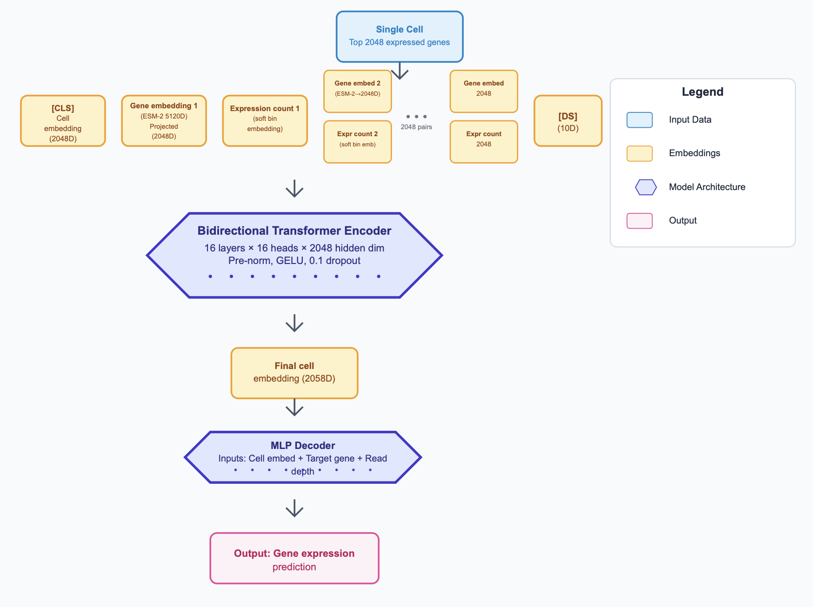

# Modeling Perturbational Effects with State-Sets

> Train Sets perturbation models or pretrain State embedding models

## Installation

Distributed via [`uv`](https://docs.astral.sh/uv).

```bash
# Clone repo
git clone github.com:arcinstitute/state-sets
cd state-sets

# Initialize venv
uv venv

# Install
uv tool install -e .
```

state-sets --help
usage: state-sets [-h] {state,sets} ...

positional arguments:
  {state,sets}

options:
  -h, --help    show this help message and exit

## Sets

An example training command for a sets model:

```bash
state-sets sets train \
  data.kwargs.toml_config_path="/home/aadduri/cell-load/example.toml" \
  data.kwargs.embed_key=X_vci_1.4.2 \
  data.kwargs.output_space=gene \
  data.kwargs.num_workers=12 \
  data.kwargs.batch_col=gem_group \
  data.kwargs.pert_col=gene \
  data.kwargs.cell_type_key=cell_type \
  data.kwargs.control_pert=non-targeting \
  training.max_steps=40000 \
  training.val_freq=100 \
  training.ckpt_every_n_steps=100 \
  training.batch_size=128 \
  training.lr=1e-4 \
  model.kwargs.cell_set_len=64 \
  model.kwargs.hidden_dim=328 \
  model=pertsets \
  wandb.tags="[test]" \
  output_dir="/home/aadduri/state-sets" \
  name="test"
```

An example evaluation command for a sets model:

```bash
state-sets sets predict --output_dir /home/aadduri/state-sets/test/ --checkpoint last.ckpt
```

The toml files should be setup to define perturbation splits, if running fewshot experiments. Here are some examples:

```toml
# example_config.toml
# Dataset paths - maps dataset names to their directories
[datasets]
replogle = "/large_storage/ctc/userspace/aadduri/datasets/hvg/replogle_copy/"

# Training specifications
# All cell types in a dataset automatically go into training (excluding zeroshot/fewshot overrides)
[training]
replogle = "train"

# Zeroshot specifications - entire cell types go to val or test
[zeroshot]
"replogle.jurkat" = "test"

# Fewshot specifications - explicit perturbation lists
[fewshot]
[fewshot."replogle.rpe1"]
# train gets all other perturbations automatically
val = ["AARS"]
test = ["AARS", "NUP107", "RPUSD4"]  # can overlap with val
```

An example with only zeroshot:

```toml
# example_config.toml
# Dataset paths - maps dataset names to their directories
[datasets]
replogle = "/large_storage/ctc/userspace/aadduri/datasets/hvg/replogle_copy/"

# Training specifications
# All cell types in a dataset automatically go into training (excluding zeroshot/fewshot overrides)
[training]
replogle = "train"

# Zeroshot specifications - entire cell types go to val or test
[zeroshot]
"replogle.jurkat" = "test"

# Fewshot specifications - explicit perturbation lists
[fewshot]
```

## State

To train a State model:

```bash
state-sets state train --conf ${CONFIG}
```

To run inference with a trained State checkpoint, e.g., the State 1.5.2 trained to 4 epochs:

```bash
state-sets state embed \
  --checkpoint "/large_storage/ctc/userspace/aadduri/vci_1.5.0_btc_step=195000_epoch=4.ckpt" \
  --config "/large_storage/ctc/userspace/aadduri/vci_1.5.0_btc.yaml" \
  --input "/large_storage/ctc/datasets/replogle/rpe1_raw_singlecell_01.h5ad" \
  --output "/home/aadduri/vci_pretrain/test_output.h5ad" \
  --embed-key "X_vci_1.5.2"
```

Here is the architecture digram of state


